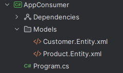
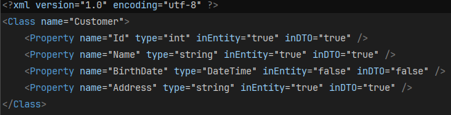
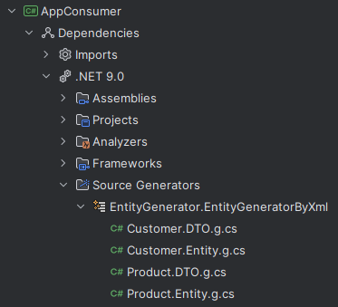
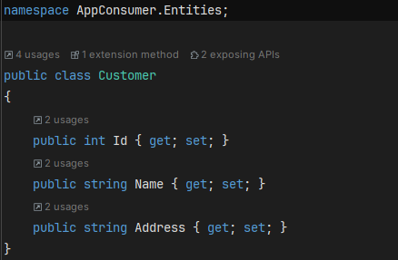
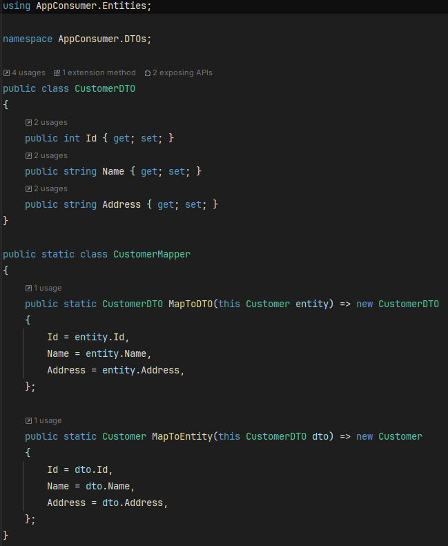
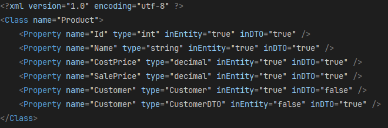
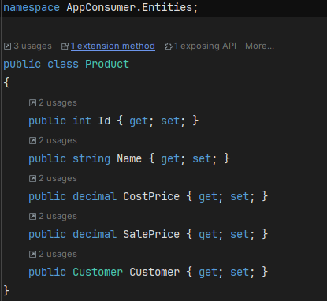

# Entity Generator
Entity generator based on XML files.

## Using the Generator
```
• Clone the project locally
• Create and configure the XML files that will be used in the generation
• Build the application
• Check the generated classes
```

## I Understand the Generator
> ### XML Structure

 The XML files must be in the Models folder and named as follows.



----
XML structure with its types and applications



> ### Generated Files


----
The DTO already has mapping methods for the corresponding entity.



----



> ### Complex Types


----


